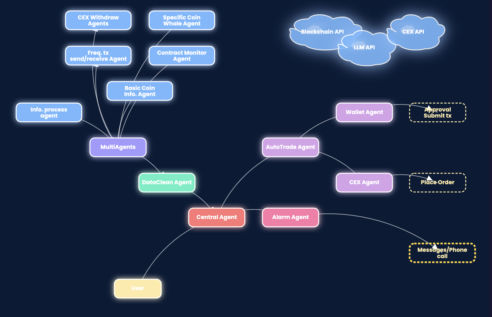

## 🌟 Multi-Agent System (eth-final)

This is a blockchain data analysis and monitoring system based on multiple collaborative agents.




Please reach our project:

[demo video](https://youtu.be/rRlGTM0aq2g?si=56ojij6JwnPbebat) | [Code](https://github.com/imio21777/ETH-Hangzhou) | [Slice](https://docs.google.com/presentation/d/12PP8DcdjcAGs9wK-RonWCDkccOxNrz_XCzRex1kifGk/edit?slide=id.p10#slide=id.p10)


### ✨ Main Features

- 📊 Blockchain data collection and processing
- 💰 Large transfer monitoring
- 📝 Contract activity monitoring
- 🏦 Exchange withdrawal analysis
- 🔍 Token information queries
- 👛 Wallet management
- 🤝 Trade automation

### 🤖 Agent Components

The system includes multiple collaborative agents, such as:

- `InfoProcessAgent`: Information processing agent
- `CentralAgent`: Central coordination agent
- `DataCleanAgent`: Data cleaning agent
- `ContractMonitorAgent`: Contract monitoring agent
- `CEXWithdrawAgent`: Exchange withdrawal monitoring agent
- And more...

### 🚀 How to Run

```bash
cd eth-final
python app.py
```

## 🖥️ Frontend Application (frontend)

The user interface provides an interactive web application to access system functionalities.

### 📁 Main Files

- `index.html`: Home page
- `app.html`: Application page
- `defi-script.js`: JavaScript functionality
- `defi-styles.css`: Stylesheet
- `app.py`: Flask server

### 🚀 Running the Frontend

```bash
cd frontend
python app.py
```

Then visit http://localhost:8000

## 🛠️ System Requirements

- Node.js 16+
- Python 3.8+
- MetaMask or other Web3 wallet
- BSC Testnet connection


## 👨‍💻 Contributors

- 0xleap https://github.com/imio21777
- Coderbak https://github.com/CoderBak
- Hendrick https://github.com/Nahtreom
- Jyrqwq https://github.com/CH3COOH-JYR

## 🔗 Related Links

- [BSC Testnet Explorer](https://testnet.bscscan.com)
- [PancakeSwap Testnet](https://pancake.kiemtienonline360.com)
